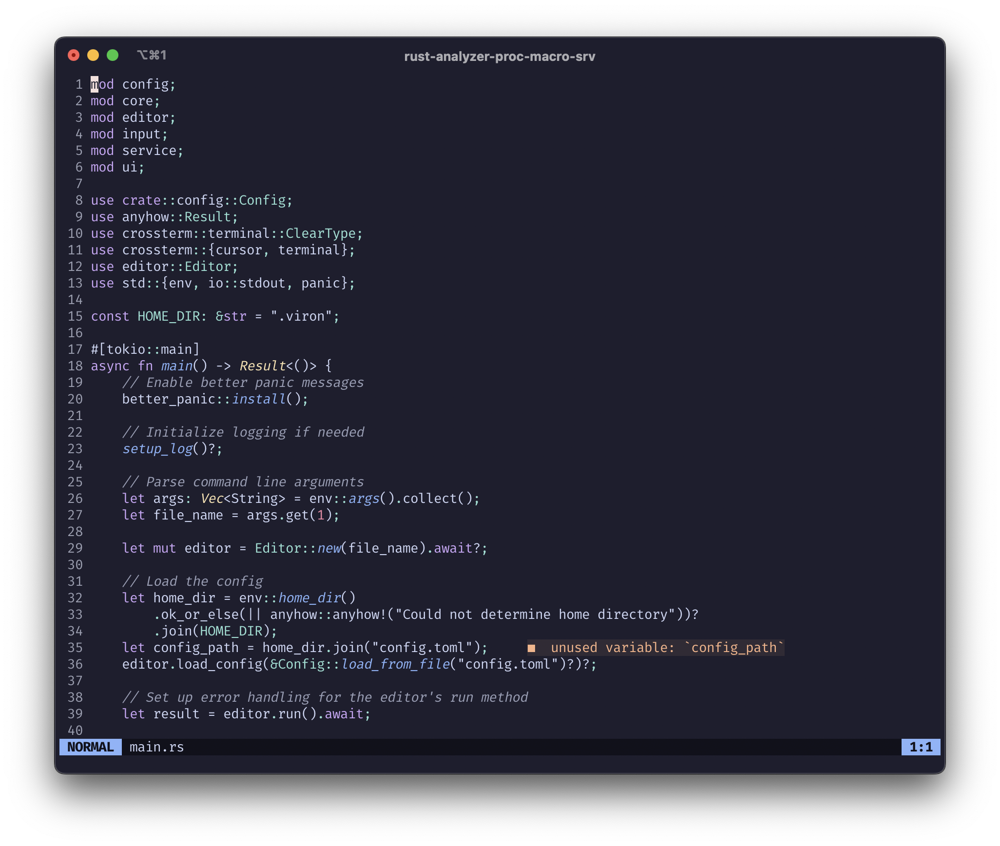

# viron 📝⚡️

**viron** is an attempt to recreate the Vim code editor in Rust. 🦀



## Features ✨

- **Vim-like modal editing**: Complete modal editing experience with normal, insert, command, and search modes. ⌨️
- **Syntax highlighting**: Powered by [tree-sitter](https://tree-sitter.github.io/tree-sitter/) for accurate and fast syntax parsing (currently supports Rust). 🌈
- **Language Server Protocol (LSP)**: Built-in LSP support with diagnostics, goto definition, and more (rust-analyzer supported). 🔍
- **Undo/Redo system**: Full edit history with seamless undo and redo capabilities. ↩️
- **Register system**: Vim-compatible yank/paste operations with multiple registers. 📋
- **Search functionality**: Fast text search with regex support and navigation. 🔎
- **Configurable themes**: Beautiful color themes following the [VS Code theme format](https://code.visualstudio.com/api/extension-guides/color-theme) (includes Catppuccin variants). 🎨
- **Smart indentation**: Automatic indentation preservation for new lines. 📐
- **Gutter with line numbers**: Configurable gutter with absolute or relative line numbers. 📊
- **Asynchronous operations**: Smooth editing experience using async Rust and [tokio](https://tokio.rs/). 🚀
- **Cross-platform terminal support**: Built on [crossterm](https://crates.io/crates/crossterm) for compatibility with most terminals. 🖥️

## Getting Started 🛠️

### Prerequisites

- [Rust](https://www.rust-lang.org/tools/install) (edition 2024 or later) 🦀
- For LSP features: [rust-analyzer](https://rust-analyzer.github.io/) in your PATH

### Build

```sh
cargo build --release
```

### Run

```sh
cargo run -- <file>
```

Replace `<file>` with the path to the file you want to edit.

### Example

```sh
cargo run -- src/main.rs
```

## Usage 🎮

### Basic Navigation (Normal Mode)

- `hjkl` or arrow keys: Move cursor
- `w`/`b`: Move by words
- `0`/`$`: Move to line start/end
- `gg`/`G`: Move to file start/end
- `zz`: Center viewport on cursor

### Editing

- `i`: Enter insert mode
- `x`: Delete character
- `dd`: Delete line
- `yy`: Yank (copy) line
- `p`: Paste after cursor
- `u`: Undo
- `Ctrl+r`: Redo

### Search and Commands

- `/pattern`: Search for pattern
- `n`/`N`: Next/previous search result
- `:q`: Quit editor
- `:w`: Write (save) file
- `Esc`: Return to normal mode

## Configuration ⚙️

viron uses a TOML configuration file located at `config.toml` in the project root (or in your system's config directory when installed).

### Key Configuration Options

- **Theme**: Choose from available themes (`theme = "catppuchin/mocha"`)
- **Gutter**: Configure line number display (`gutter = "relative"` or `"absolute"` or `"none"`)
- **Keymaps**: Fully customizable key bindings organized by context:
  - `keymap.default` — Global keybindings
  - `keymap.movement` — Movement commands (hjkl, arrows, word navigation)
  - `keymap.normal` — Normal mode specific bindings
  - `keymap.insert` — Insert mode specific bindings
  - `keymap.command` — Command mode bindings
  - `keymap.search` — Search mode bindings

### Adding Custom Themes

Add theme files to the `themes/` directory following the VS Code theme format. viron supports:

- Syntax highlighting colors
- Editor background and foreground
- UI element styling
- Diagnostic message styling

### Language Server Setup

viron automatically detects and connects to language servers when available:

- **Rust**: Requires `rust-analyzer` in PATH
- Additional language servers can be added by extending the `Language` enum

## Project Structure 🗂️

- `src/` — Main source code
  - `actions/` — Editor actions and command system
    - `types/` — Specific action implementations (editing, movement, search, etc.)
    - `core/` — Action execution framework
  - `config/` — Configuration management and editor settings
  - `core/` — Core editor functionality
    - `buffer/` — Gap buffer implementation for efficient text editing
    - `command/` — Command and search buffer management
    - `history/` — Undo/redo system with edit history
    - `register/` — Vim-compatible register system for yank/paste
  - `editor/` — Main editor orchestration
  - `input/` — Input processing, keymaps, and event handling
  - `service/` — External services integration
    - `lsp/` — Language Server Protocol client implementation
  - `ui/` — User interface components and rendering
    - `components/` — Individual UI components (editor view, status line, etc.)
    - `theme/` — Theme system and color management
- `themes/` — Color themes in JSON format (VS Code compatible)
- `config.toml` — Editor configuration with keymaps and settings

## Dependencies 📦

### Core Dependencies

- [anyhow](https://crates.io/crates/anyhow) — Error handling and context
- [crossterm](https://crates.io/crates/crossterm) — Cross-platform terminal manipulation
- [tokio](https://crates.io/crates/tokio) — Async runtime for non-blocking operations
- [tree-sitter](https://crates.io/crates/tree-sitter) — Syntax highlighting and parsing
- [tree-sitter-rust](https://crates.io/crates/tree-sitter-rust) — Rust language support for tree-sitter

### Serialization & Configuration

- [serde](https://crates.io/crates/serde) — Serialization framework
- [serde_json](https://crates.io/crates/serde_json) — JSON support for theme files
- [toml](https://crates.io/crates/toml) — Configuration file parsing

### Language Server Protocol

- [lsp-types](https://crates.io/crates/lsp-types) — LSP type definitions and protocol support

### Utilities

- [regex](https://crates.io/crates/regex) — Regular expression support for search
- [nom](https://crates.io/crates/nom) — Parser combinators for command parsing
- [futures](https://crates.io/crates/futures) — Async utilities
- [async-trait](https://crates.io/crates/async-trait) — Async trait support
- [similar](https://crates.io/crates/similar) — Text diffing for edit operations
- [dirs](https://crates.io/crates/dirs) — Platform-specific directory paths
- [once_cell](https://crates.io/crates/once_cell) — Global initialization utilities
- [log](https://crates.io/crates/log) & [env_logger](https://crates.io/crates/env_logger) — Logging infrastructure
- [better-panic](https://crates.io/crates/better-panic) — Enhanced panic messages

## Key Features in Detail 🔍

### Modal Editing

- **Normal Mode**: Navigation and text manipulation
- **Insert Mode**: Text insertion with smart indentation
- **Command Mode**: Execute editor commands (`:q`, `:w`, etc.)
- **Search Mode**: Find text with regex support (`/pattern`)

### Text Editing Capabilities

- Gap buffer for efficient insertion/deletion
- Vim-compatible undo/redo with full edit history
- Smart indentation preservation
- Line-based operations (delete line, yank line)
- Character and line-wise registers

### Language Support

- **Rust**: Full syntax highlighting and LSP integration
- **Plain Text**: Basic editing for unsupported file types
- Extensible architecture for adding new languages

### LSP Integration

- Real-time diagnostics with inline error display
- Goto definition support
- Document change synchronization
- Automatic server lifecycle management

## Roadmap 🛣️

### Enhancement Wishlist

- [ ] Visual mode selection
- [ ] Multiple language support (JavaScript, TypeScript, Python, Go, etc.)
- [ ] Split window/tab support
- [ ] Plugin system
- [ ] More LSP features (hover, completion, formatting)
- [ ] File explorer
- [ ] Git integration
- [ ] Improved search and replace
- [ ] Macro recording and playback

### Language Support Expansion

The editor is designed to easily support additional languages through tree-sitter. Currently implemented:

- ✅ Rust (with LSP)
- ✅ Plain text
- 🚧 JavaScript, TypeScript, Python, Go, C/C++ (parsing only)

## Contributing 🤝

Contributions are welcome! Please open issues or pull requests to help improve viron.

## License 📄

This project is licensed under the MIT License.
